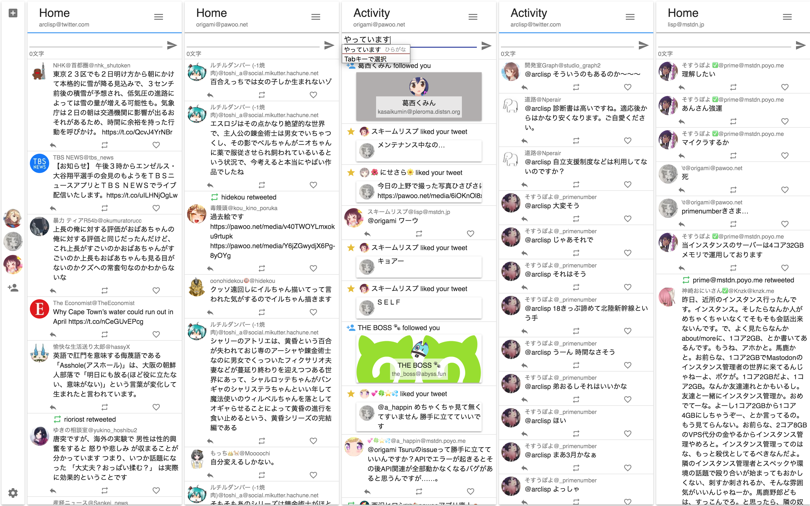

# Tsuru  
  
Twitter, GNU Social, Mastodonのアカウントを一つの画面にまとめて表示できるTweetdeck風クライアントです。   
  
  
Roadmapや進捗状況は以下から確認できます。
* [Wiki](https://scrapbox.io/tsuruclient)
* [Tsuru Roadmap](https://trello.com/b/Id3TjFbr/tsuru)
* [Work in progress](https://github.com/tsuruclient/tsuru/projects/3)  
* [Bugtrucker](https://github.com/tsuruclient/tsuru/projects/2)  
  
  
## 自前でビルドする際の注意点
### アプリの起動  
`npm run dev`あるいは`yarn dev`コマンドで起動してください。`start`では正常に起動しません。  
  
### ビルド
`npm run build`の実行後に`npm run package`を行ってください。  
  
### instanceList.jsについて
`src/core/constant/instanceList.js` は意図的に除外してあり、import errorを起こします。  
そのため、各自でビルドする際は`src/core/constant/_instanceList.js`を`instanceList.js`にリネームしてください。
  
### Remote Contentに関するセキュリティ警告  
`npm run dev`を実行した時、表示されたElectronアプリのコンソールにSecurity Warningが表示されることに気がつくはずです。  
これは開発時のホットリロードを可能にするためにreact-scriptsが別に立ち上がっており、Electronがそのサーバにアクセスするためによって起こる警告です。  
ビルド時にはこの警告は消えるため、気にしないことをおすすめします。少々目障りですが…
  
## 次回リリース予定  
3月

## Tsuruへの参画  
このプロジェクトには誰でも参加可能です。  
問題の報告、コードの改善とプルリクエストを歓迎します！    
  
## 支援の募集  
FounderであるOrigamiはあまり裕福ではなく、金銭的サポートを募集しています。  
  
## LICENSE
このソフトウェアはMIT License下において公開されています。
