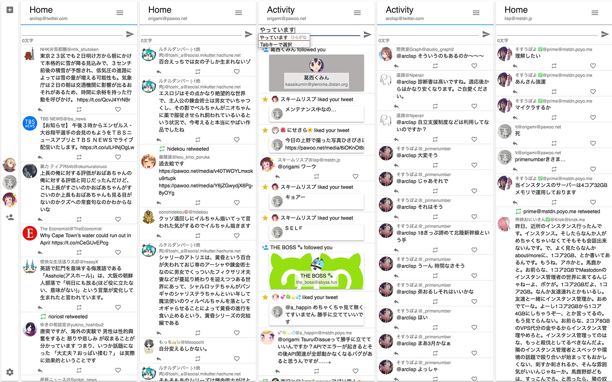

# Tsuru  
 

Cross Platform, TweetDeck like UI, more UX, and support many services.  
**WARN:IN DEVELOPING**  
  
  
## Project Goal
### Support many services
For example, Twitter, GNU Social, Mastodon, Slack, Discord will be support.  
OR, to be available REST API, Streaming API, Websocket supported service by plugin.  
  
### Powerup with plugin
Add Service, Language, Theme definable by plugin.  
  
## Roadmap and wiki
* [Wiki](https://scrapbox.io/tsuruclient)
* [Tsuru Roadmap](https://trello.com/b/Id3TjFbr/tsuru)
* [Work in progress](https://github.com/tsuruclient/tsuru/projects/3)  
* [Bugtrucker](https://github.com/tsuruclient/tsuru/projects/2)  
  
## Contributing
[is here](CONTRIBUTING.md)
  
## 自前でビルドする際の注意点
### アプリの起動  
`npm run dev`あるいは`yarn dev`コマンドで起動してください。`start`では正常に起動しません。  
  
### ビルド
`npm run build`の実行後に`npm run package`を行ってください。  
  
### instanceList.jsについて
`src/core/constant/instanceList.js` は意図的に除外してあり、import errorを起こします。  
そのため、各自でビルドする際は`src/core/constant/_instanceList.js`を`instanceList.js`にリネームしてください。
  
### Remote Contentに関するセキュリティ警告  
`npm run dev`を実行した時、表示されたElectronアプリのコンソールにSecurity Warningが表示されることに気がつくはずです。  
これは開発時のホットリロードを可能にするためにreact-scriptsが別に立ち上がっており、Electronがそのサーバにアクセスするためによって起こる警告です。  
ビルド時にはこの警告は消えるため、気にしないことをおすすめします。少々目障りですが…  
  
## LICENSE
このソフトウェアはMIT License下において公開されています。
